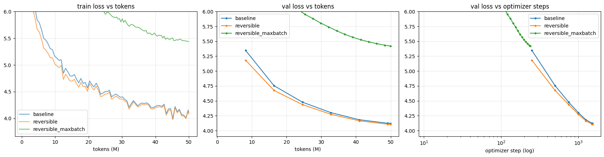
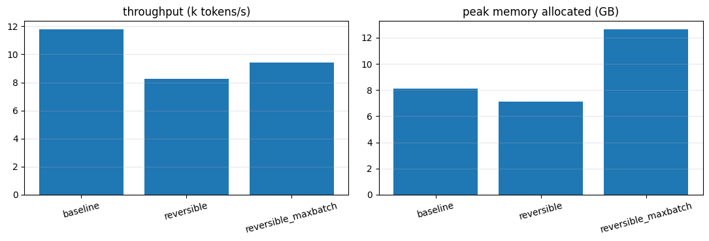
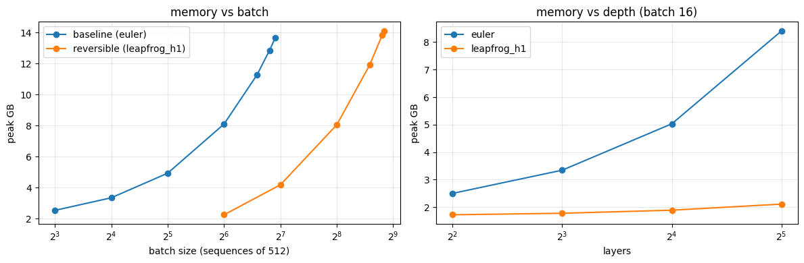

# Assignment 13: Reversible transformers, a 20M-parameter LLM trained on 50M tokens

This repo trains a 20M-parameter decoder-only LLM on 50M tokens of FineWeb-Edu three times:

| # | run | residual stream | batch |
|---|---|---|---|
| 1 | `baseline` | standard (Euler) residual, normal backprop | **fixed**: largest power of two the baseline fits |
| 2 | `reversible` | reversible stepping rule (best of Hamiltonian / midpoint(a) / plain midpoint / leapfrog), activations rebuilt in backward | same fixed batch |
| 3 | `reversible_maxbatch` | same reversible model | **maximum** batch that fits |

For each run we report the final loss, throughput (tokens/s), peak GPU memory and other findings.

```
revllm/model.py      model, 3 reversible schemes (4 named variants) with exact inverses, RevStackFn (custom autograd)
revllm/data.py       FineWeb-Edu -> uint16 .bin tokenisation; deterministic batching
revllm/train.py      training loop, metrics, max-batch search
notebooks/00_data_prep.ipynb             tokenise 51M train + 1M val tokens (run once, stored on Drive)
notebooks/01_baseline.ipynb              run 1 (+ batch-size search)
notebooks/02_reversible.ipynb            gradient check, precision drift, memory table, variant sweep, run 2
notebooks/03_reversible_maxbatch.ipynb   memory vs depth, max-batch search, run 3
notebooks/04_results.ipynb               tables and plots -> results/
tests/test_reversible.py                 reversible grads == autograd grads (fp64); inverse round-trip; chunked CE;
                                         all params get grads under bf16 autocast (backward inside or outside)
```

---

## 1. Setup

Data: notebook 00 streamed FineWeb-Edu and wrote 51,000,000 train and 1,000,000 val tokens (max token id 31 985 < 32 000). A 20M model after 50M tokens is still a very rough language model. The baseline's sample for "The water cycle is": *"The water cycle is 100 percent easier because the water temperatures are 10 percent lower. The water system for water is water quality, …"* It produces fluent-looking English without coherent content, which is expected at a loss of about 4.1.


| | |
|---|---|
| Model | decoder-only transformer, pre-RMSNorm, RoPE, SwiGLU MLP, tied embeddings |
| Size | d_model 320, 8 layers, 5 heads (head dim 64), d_ff 864, vocab 32 000 → **20.16M params** (10.24M embedding + 9.92M blocks) |
| Context | 512 tokens |
| Data | FineWeb-Edu `sample-10BT`, streamed; first 1M tokens → val, next 50M → train |
| Tokenizer | Llama-2 SentencePiece (via `TinyLlama/TinyLlama-1.1B-Chat-v1.0`), 32k vocab, so tokens fit in uint16 |
| Token budget | one pass over the same shuffled order of 97 656 windows of 512 (50M tokens), fixed seed. A run at batch B trains on the first ⌊97 656 / B⌋·B windows, so every run sees a prefix of the same order and at most B − 1 windows are dropped; each run records its exact `tokens_trained` |
| Optimiser | AdamW (β 0.9/0.95, wd 0.1 on matrices), grad clip 1.0, linear warm-up then cosine decay to 10% of peak |
| LR | 1e-3 at the fixed batch; run 3 uses 1e-3·√(B_max/B_fixed), capped at 3e-3, with 10% warm-up |
| Precision | autocast bf16 (A100/L4) or fp16 with GradScaler (T4). The residual streams stay in fp32 |
| Loss | chunked cross-entropy (4096 rows per chunk, checkpointed), so the (B·T × 32k) fp32 logits never exist in full. All runs use it, so memory is dominated by the transformer body, which is the part reversibility changes |
| Metrics | **final train loss** = mean of the last 5% of logged steps; **final val loss** = 409k held-out tokens; **tokens/s** = train-step time only, excluding evals and the first logging window; **peak memory** = `torch.cuda.max_memory_allocated` (also reported: `max_memory_reserved`) |

No `torch.compile` in any run. The reversible autograd function calls `autograd.backward` inside its own backward, which compile does not trace, and leaving compile off everywhere keeps the throughput comparison fair.

---

## 2. Reversibility

A residual network is the explicit **Euler** discretisation of an ODE, `p_{j+1} = p_j + f_j(p_j)`, where `f_j` is block j's increment (attention followed by the MLP). **Euler is the non-reversible baseline, not one of the reversible variants.** Recovering `p_j` from `p_{j+1}` would mean solving `p = p_{j+1} − f(p)`, which has no closed form, so backprop has to store every `p_j`.

The reversible schemes carry **two** state tensors. Each step then has an *explicit* algebraic inverse, so backward can rebuild layer j's input from layer j+1's output. Only the final state is stored, and activation memory becomes **O(1) in depth** instead of O(L). Every hyper-parameter below is set explicitly (`revllm/model.py: VARIANTS`), because library defaults differ.

| key | scheme | forward step | exact inverse | output |
|---|---|---|---|---|
| `hamiltonian` | **Hamiltonian, a = b = 1** (identical to RevNet / Reformer additive coupling) | p' = p + Attn(q); q' = q + MLP(p') | q = q' − MLP(p'); p = p' − Attn(q) | (p+q)/2 |
| `midpoint_a0.5_h0.25` | **midpoint(a)**, the lesson's recipe (step 0.25, blend 0.5) | p_{j+1} = a·p_{j−1} + (1−a)·p_j + h·f_j(p_j) | p_{j−1} = (p_{j+1} − (1−a)·p_j − h·f_j(p_j)) / a | p_L |
| `midpoint_plain_h0.25` | plain midpoint, the paper's eq. (2.4) at h = 0.25 (coded as midpoint(a) with a = 1, h = 0.5) | p_{j+1} = p_{j−1} + 2h·f_j(p_j) | p_{j−1} = p_{j+1} − 2h·f_j(p_j) | (p_{L−1}+p_L)/2 |
| `leapfrog_h1` | velocity Verlet (second order) | v' = v + h·f(x); x' = x + h·v' | x = x' − h·v'; v = v' − h·f(x) | x_L |

All models have **identical parameter counts (20.16M)**. Only the wiring of the residual stream differs. The states are initialised to (p₋₁, p₀) = (e, e), or to (x, v) = (e, 0) for leapfrog, where e is the token embedding.

The two midpoint rows are two recipes, each at h = 0.25 in its own equation from the paper, not an isolation of a. They differ in three settings at once: the blend a (0.5 vs 1), the increment coefficient (h = 0.25 vs 2h = 0.5), and the readout (p_L vs the average of the last two states). A difference in their loss cannot be attributed to a alone.

Why midpoint(a) and not plain midpoint:
- **Stability.** On the test problem f(p) = λp, the recurrence p_{j+1} = a·p_{j−1} + (1−a)·p_j + c·λ·p_j (c = the increment coefficient) has roots r² − (1 − a + cλ)·r − a = 0. At a = 1 the roots at cλ = 0 are +1 and a parasitic −1. For a real **negative** eigenvalue, a direction the block damps, the parasitic root grows even though the true solution decays: at cλ = −0.5, |r| = 1.28 and 0.78. With a = 0.5 the parasitic root sits at −a, and both roots have |r| = 0.71 at cλ = −0.5. For a real positive eigenvalue the large root is the principal one, i.e. growth the underlying ODE has too (Euler also gives 1 + cλ = 1.5). The paper states midpoint's weakness as sensitivity to real positive eigenvalues; on this test problem the spurious growth is on the negative side.
- **Cost.** The paper's analysis requires |a| = 1 for stability in both directions. At a = 0.5 the forward pass is damped, and the inverse divides by a, so reconstruction error can grow by up to 1/a = 2 per layer, 2⁸ = 256× over 8 layers in the worst case. The measured penalty (below) is 4.5×, far under that bound.

### Backward pass: one extra block evaluation per layer

`RevStackFn` runs the forward pass with no graph and stores only the final (p, q). In backward, for each layer from the top down, `Stepper.backward_step` evaluates the block **once** with grad. That single evaluation provides both the reconstruction (from its detached output) and the VJP. For midpoint(a):

```python
y = f(p_j)                                           # with grad, evaluated once
p_prev = (p_next - (1-a)*p_j - h*y.detach()) / a     # reconstruction reuses it
# dL/dp_prev = a*g_next ;  dL/dp_j = g_j + (1-a)*g_next + vjp(h*y, g_next)
```

The Hamiltonian variant evaluates MLP(p') and then Attn(q) once each in the same way. Cost per layer is 1 forward + 1 re-evaluation + 1 backward ≈ **4 forward-equivalents vs 3 for the baseline** (about 33% more compute). That is the lesson's "one extra block evaluation". Checked with a forward hook on every attention and MLP module: one train step makes **4L** such calls for every reversible variant against **2L** for Euler, i.e. each block is evaluated twice instead of once. A local Apple-MPS run measured throughput at **0.84–0.86× the baseline** at the same batch; that figure is not reproduced by this repo's notebooks, and §3 reports the T4 number. Autocast state is captured in forward and restored in backward, so the re-evaluation runs in the same precision.

### Correctness and drift checks

Pre-run numbers, measured on CPU (PyTorch 2.5.1, 1 thread, bf16 autocast, random init, seed 0, full 20M model at B = 4 for the bf16 rows). Notebook 02 re-measures every row on the GPU, and those numbers replace these in §3.

| check | hamiltonian | midpoint(a=0.5, h=0.25) | plain midpoint | leapfrog |
|---|---|---|---|---|
| fp64 reversible vs autograd, max \|Δgrad\| (notebook-02 config) | 1.4e-17 | 1.0e-17 | 1.4e-17 | 5.6e-17 |
| bf16, 8-layer reconstruction rel. error | 1.7e-3 | **9.4e-3** | 2.1e-3 | 2.7e-2 |
| bf16, gradient rel. error vs autograd | 0.4% | 0.3% | 0.3% | 2.1% |
| **T4 (notebook 02):** fp64 max \|Δgrad\| | 6.9e-18 | 1.4e-17 | 1.4e-17 | 7.6e-17 |
| **T4:** bf16, 8-layer reconstruction rel. error | 1.2e-3 | **1.5e-2** | 2.1e-3 | 2.9e-2 |
| **T4:** bf16, gradient rel. error vs autograd | 0.37% | 0.36% | 0.34% | 2.98% |

An earlier local Apple-MPS run reported gradient errors of 1.1 / 4.7 / 1.0 / 6.3%. They did not reproduce here, so they are withdrawn. In particular, midpoint(a) does **not** cost gradient accuracy at init: its penalty shows up only in reconstruction.

Activations saved for backward, B = 4, T = 512 (autograd saved-tensor hooks, each storage counted once, bf16 autocast):

| layers | Euler, CPU | Euler, **T4** | any reversible variant, **T4** | reduction on T4 |
|---|---|---|---|---|
| 8 | 345 MB | 462 MB | 47–49 MB | 9.4–9.8× |
| 16 | 643 MB | 880 MB | 47–49 MB | 18–19× |
| 32 | – | 1716 MB | 47–49 MB | 35–37× |

On the T4 Euler grows by about 52 MB per layer at B = 4. The reversible column does not move at all between 8 and 32 layers.

Three things stand out. First, **depth drops out** of the reversible column. Second, midpoint(a)'s division by a costs more reconstruction error than plain midpoint: 4.5× on CPU (9.4e-3 vs 2.1e-3) and 7× on the T4 (1.5e-2 vs 2.1e-3), far below the 256× worst case. Third, that reconstruction penalty does not carry into the gradient at init (0.36% vs 0.34% on the T4). Leapfrog is the outlier on both counts, with about 3% gradient error.

**A bug these checks caught.** Autocast caches each weight's low-precision cast for the whole autocast region. `RevStackFn.forward` runs with grad disabled, so its cached casts carry no graph. When `backward()` was called *inside* the autocast region, the backward re-evaluation reused those casts, and 16 of 26 parameters (every block weight matrix) silently received no gradient. `train_step` calls backward outside autocast, so training was unaffected; notebook 02's drift cell calls it inside, and would have crashed. The fix is `cache_enabled=False` for the autocast context in the reversible backward (`revllm/model.py: _amp_state`), guarded by `tests/test_reversible.py::test_autocast_grads_present_and_close`. That test fails on the unfixed code (4 of 8 cases) and passes after the fix.

---

## 3. Results

All numbers come from the executed notebooks on Colab (**Tesla T4, 15 360 MiB**). `results/RESULTS.md` is the table that notebook 04 generated.

> **Precision caveat.** These runs used **bf16 autocast on a T4**. The T4 (sm_75) has no bf16 tensor cores, and PyTorch reports bf16 as supported only through emulation. Every run used the same setting, so the ratios between runs are like-for-like. The absolute tokens/s, however, are far below what the T4 can do in fp16. `amp_dtype` has since been changed to use fp16 on pre-Ampere GPUs (bf16 only from compute capability 8.0).

### Main table: 20.16M params, 50M tokens each

| run | residual | batch (seq × 512) | optimizer steps | final train loss | final val loss | tokens/s | peak mem alloc (GB) | peak mem reserved (GB) | wall time (min) |
|---|---|---|---|---|---|---|---|---|---|
| 1 · baseline | euler | 64 (fixed) | 1 525 | 4.0896 | 4.1205 | 11 782 | 8.10 | 8.58 | 72.1 |
| 2 · reversible | leapfrog_h1 | 64 (fixed) | 1 525 | **4.0769** | **4.1055** | 8 275 | 7.14 ‡ (train step: **2.26**) | 8.23 ‡ | 102.2 |
| 3 · reversible, max batch | leapfrog_h1 | **408** | 239 | 5.4475 | 5.4190 | 9 420 | 12.64 | 14.42 | 92.5 |

Relative to the baseline:

| | throughput | peak memory | val loss |
|---|---|---|---|
| run 2 (same batch) | **0.70×** | **0.28×** (2.26 vs 8.11 GB, train step) | −0.015 |
| run 3 (max batch) | **0.80×** | 1.56× (it fills the GPU on purpose) | +1.30 |

‡ **Run 2's logged peak includes evaluation.** Under `torch.no_grad()` the loss fell back to full-vocabulary fp32 logits, and at this batch that eval pass, not training, set the 7.14 GB peak. The train-step peak of the same model at the same batch, measured separately by `fits()`, is **2.26 GB** (next table). The baseline (8.10 GB) and run 3 (12.64 GB) are dominated by training, so eval does not affect them. This has since been fixed: evaluation now uses the chunked loss, and `train()` resets evaluation out of the reported peak.

### Validation loss during training (runs 1 and 2, same batch and data)

| step (tokens) | 250 (8.2M) | 500 (16.4M) | 750 (24.6M) | 1000 (32.8M) | 1250 (41.0M) | 1500 (49.2M) | 1525 (50.0M) |
|---|---|---|---|---|---|---|---|
| baseline (euler) | 5.3481 | 4.7544 | 4.4779 | 4.3018 | 4.1828 | 4.1236 | 4.1205 |
| reversible (leapfrog_h1) | **5.1826** | **4.6751** | **4.4371** | **4.2739** | **4.1640** | **4.1080** | **4.1055** |
| gap | −0.166 | −0.079 | −0.041 | −0.028 | −0.019 | −0.016 | −0.015 |

The reversible run leads at every evaluation, and the gap shrinks steadily as training proceeds. Leapfrog learns faster early on, and both runs converge to nearly the same loss.

### Batch sizes

| | batch (sequences × 512) | tokens / step | optimizer steps for 50M tokens |
|---|---|---|---|
| baseline max | 120 | 61 440 | – |
| **fixed** (runs 1 & 2) | **64** | 32 768 | 1 525 |
| reversible max (run 3 search) | **456** (3.8× the baseline max, 7.1× the fixed batch) | 233 472 | 214 |
| reversible trained (run 3) | **408** | 208 896 | 239 |

Baseline search trace: 16 → 3.35 GB, 32 → 4.93, 64 → 8.10, 96 → 11.27, 112 → 12.85, 120 → 13.65; 128 ran out of memory. The fixed batch is the largest power of two at or below 120, i.e. 64.

The reversible search found 456 by running two full train steps at that size, but the real run went out of memory at 456, probably from allocator fragmentation over many steps or from the eval pass, which used full-vocabulary logits at the time. The notebook's fallback retried at 90% of that, 408, and finished. Search trace: 128 → 4.18 GB, 256 → 8.05, 384 → 11.92, 448 → 13.85, 456 → 14.10; 464, 480 and 512 ran out of memory.

My pre-run prediction was a baseline max of ≈ 150 and a reversible max of 800–1000+. Both were too high, because the T4 needs more activation memory per sequence than the CPU measurements suggested. Run 3 still got only 239 optimizer steps, the step starvation the prediction was about.

### Train-step peak memory at the fixed batch (B = 64, `fits()`)

| model | plain autograd | reversible backprop | reduction |
|---|---|---|---|
| euler (baseline) | **8.11 GB** | – | – |
| hamiltonian | 8.11 GB | **2.20 GB** | 3.7× |
| midpoint(a=0.5, h=0.25) | 8.11 GB | **2.18 GB** | 3.7× |
| plain midpoint (h=0.25) | 8.11 GB | **2.14 GB** | 3.8× |
| leapfrog (h=1) | 8.11 GB | **2.26 GB** | 3.6× |

Each number is the peak over two full optimizer steps, including weights, gradients and AdamW state. With plain autograd every variant costs exactly what Euler costs, so the saving comes entirely from reversible backprop, not from the rewiring.

### Memory vs depth (batch 16, `fits()`)

| layers | Euler peak (GB) | leapfrog_h1 peak (GB) | ratio |
|---|---|---|---|
| 4 | 2.50 | 1.73 | 1.4× |
| 8 | 3.35 | 1.78 | 1.9× |
| 16 | 5.03 | 1.89 | 2.7× |
| 32 | 8.40 | 2.11 | **4.0×** |

Euler adds about **0.21 GB per layer**; the reversible model adds about **0.014 GB per layer**, which is just the extra weights, gradients and AdamW state (≈ 1.24M params × 16 bytes ≈ 20 MB). What remains (≈ 1.7 GB) is independent of depth: embeddings, the loss chunk, one layer's live graph, and the CUDA context.

### Which reversible variant worked (5M-token sweep at B = 64)

| variant | val loss @ 5M | final train loss | tokens/s | recon rel. err (init, bf16) | grad rel. err (init, bf16) |
|---|---|---|---|---|---|
| hamiltonian (a=b=1) | 6.3162 | 6.2928 | 8 418 | 1.2e-3 | 0.37% |
| midpoint(a=0.5, h=0.25) | 6.3351 | 6.3147 | 8 285 | 1.5e-2 | 0.36% |
| plain midpoint (h=0.25) | 6.1561 | 6.1341 | 8 316 | 2.1e-3 | 0.34% |
| **leapfrog (h=1)** | **6.0400** | **6.0164** | 8 306 | 2.9e-2 | 2.98% |

B = 64, 152 optimizer steps (5M tokens) each, one seed, 13.4–13.5 min per variant. The sweep runs' logged peaks (7.05–7.14 GB) include evaluation, like run 2's (‡ above).

**Variant used for runs 2 and 3: `leapfrog_h1`.** It had the lowest validation loss after 5M tokens and led at every evaluation from step 20 onward. It finished 0.12 below plain midpoint and 0.28–0.30 below the Hamiltonian and midpoint(a) variants. It is also the variant with the largest precision drift. The lesson's recipe, midpoint(a=0.5, h=0.25), came last by a small margin. With one seed and 152 steps, that ranking says more about early learning speed than about final quality.

### Plots





---

## 4. Findings

1. **Reversibility cuts memory 3.6× at the same batch, and more with depth.** At B = 64 the train-step peak fell from **8.11 GB to 2.26 GB**. Activations saved for backward stay at 47–49 MB whether the model has 8 or 32 layers, while Euler's grow linearly (462 → 880 → 1716 MB at B = 4). End to end, the memory ratio grows with depth: 1.4× at 4 layers, 1.9× at 8, 2.7× at 16, **4.0× at 32** (batch 16). Past about 4 layers, depth effectively drops out of the memory cost. That is the lesson's central claim, reproduced on a T4.
2. **It costs 30% throughput at the same batch.** Run 2 ran at **0.70×** the baseline's tokens/s (8 275 vs 11 782). The lesson's cost model predicts 0.75×: one extra block evaluation per layer, 4 forward-equivalents instead of 3. The remaining gap is likely kernel-launch and bookkeeping overhead from re-running each layer separately in backward, which the idealised count ignores.
3. **Same batch, same quality.** Run 2 finished at val loss **4.1055** against the baseline's 4.1205. It was ahead at every evaluation (table below), and it has the same parameter count and data. Reversible backprop did not cost accuracy. The small lead is the leapfrog architecture, not the backprop, and it is a single seed.
4. **Max batch: 7.1× the fixed batch fits, and throughput recovers somewhat.** The reversible model fits **456** sequences (trained at 408) against the baseline's 120. The bigger batch lifted throughput from 8 275 to **9 420 tok/s** (+14%). That is still 0.80× the baseline: a bigger batch amortises per-step overhead but cannot remove the extra block evaluation.
5. **At a fixed 50M-token budget, the max batch loses badly: val loss 5.42 vs 4.11.** Run 3 saw the same tokens in only **239** optimizer steps against 1 525. The loss-vs-steps panel shows why: run 3 lands right on the fixed-batch runs' per-step curve (5.42 at step 239 vs 5.18–5.35 at step 250), so each step's 6.4× more tokens bought almost nothing. This suggests B = 64 is already above the critical batch size for this model at this stage of training: the number of updates limits progress, not gradient noise. The two runs' learning-rate schedules differ (run 3 is fully decayed by step 239), so that comparison is indicative, not exact. The larger batch pays off only under a fixed budget of steps or wall-clock time on a model big enough to use it, not under a fixed token budget.
6. **Variants.** All four trained stably and none diverged. Leapfrog (h = 1) learned fastest despite having the largest bf16 drift (2.9e-2 reconstruction and 3% gradient error at init). After training its reconstruction error grew to **21%** in bf16 (0.214, relative, after inverting 8 layers). Even so, run 2 matched the baseline's loss, so at 8 layers the drift did not hurt training. On a deeper model, or at a higher learning rate, it would be the first thing to check. midpoint(a) pays about 7× plain midpoint's reconstruction error for its division by a, but not in gradient error.
7. **Practical notes.**
   - The dropout rate must be 0 (or the RNG must be replayed), or the re-evaluation will not match the forward.
   - `torch.compile` does not trace the custom backward.
   - A custom recompute path must not reuse autocast's cast cache. If backward runs inside the same autocast region, the forward's no-grad casts are reused in the backward re-evaluation, and every block weight's gradient is silently dropped (see §2).
   - Chunk the cross-entropy in evaluation too. Otherwise the eval pass, not training, sets the peak-memory figure: 7.1 GB was reported here against a true train-step peak of 2.3 GB.
   - Check the autocast dtype on older GPUs. `torch.cuda.is_bf16_supported()` returns True on a T4 through emulation.
   - A max batch found by a 2-step probe is not safe for a long run: the run went out of memory at the probed 456 and needed the fallback to 408.

---

## 5. Reproduce

1. Push this repo to GitHub as `gaurkhare/gaurav-eagv5-s13` (the `REPO_URL` in each notebook's first cell); change it there if the repo lives elsewhere.
2. In Colab, select a GPU runtime and run the notebooks **in order**: `00 → 01 → 02 → 03 → 04`. Data and results persist in `MyDrive/era_a13/`, so each notebook can run in a fresh session.
3. The last cell of `04` copies `results/*` into the repo checkout. Download it, or commit it from Colab, together with the executed notebooks.

Locally: `pip install -r requirements.txt`, then `pytest tests/`. The notebooks also run from `notebooks/` on CUDA, MPS or CPU. MPS reports driver memory, not true peak allocation, so memory numbers are only meaningful on CUDA.
